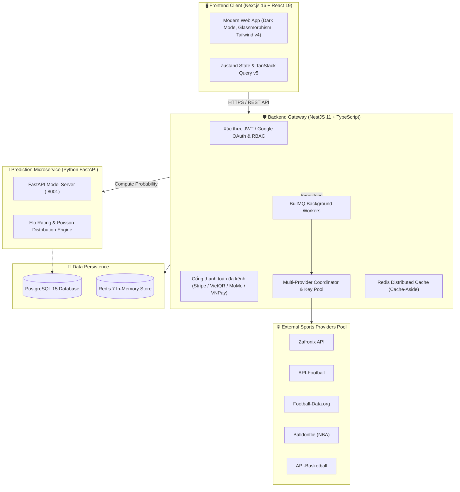

# ⚽🏀 iKnowBall — Next-Gen AI Sports Analytics & Prediction Platform

  
  
  
  
  
  

---

## 📖 Giới Thiệu Tổng Quan

**iKnowBall** là nền tảng phân tích và dự đoán dữ liệu thể thao đỉnh cao thế hệ mới, kết hợp sức mạnh của **Trí tuệ Nhân tạo (Machine Learning)**, **Thuật toán Hệ số Elo** và **Mô hình Phân phối Poisson** để cung cấp cho người hâm mộ và nhà đầu tư thể thao cái nhìn trực quan, minh bạch và chính xác nhất về xác suất kết quả trận đấu.

Hệ thống hỗ trợ toàn diện cả **Bóng đá (Football)** hàng đầu thế giới (Ngoại hạng Anh, La Liga, Champions League, Serie A,...) và giải **Bóng rổ nhà nghề Mỹ (NBA)**, tích hợp radar cảnh báo biến động tỷ lệ cược (Value Bet / Arbitrage Radar) và cổng thanh toán hội viên đa kênh.

---

## ✨ Điểm Nhấn & Tính Năng Vượt Trội

### 1. 🤖 Động Cơ Dự Đoán AI & Minh Bạch Thuật Toán (Explainable AI)
* **Xác suất đa chiều (Probability Engine)**: Tính toán chính xác tỷ lệ Thắng - Hòa - Thua (1X2), Tài/Xỉu bàn thắng (Over/Under 2.5), Cả hai đội cùng ghi bàn (BTTS).
* **Mô hình Elo & Phong độ thích ứng**: Tự động hiệu chỉnh điểm Elo động theo kết quả từng trận, tính đến lợi thế sân nhà, độ khốc liệt của giải đấu và phong độ 5 trận gần nhất.
* **Minh bạch dự đoán (XAI)**: Trực quan hóa các yếu tố tác động (Feature Importance), hiển thị độ tin cậy và lịch sử đánh giá chất lượng mô hình qua chuẩn toán học quốc tế (**Brier Score** & **Log Loss**).

### 2. ⚡ Radar Cảnh Báo Kèo Thơm (Value Bet & Odds Fluctuation)
* **Value Bet Finder (+EV)**: Tự động so khớp xác suất mô hình AI với tỷ lệ cược thực tế của các nhà cái để phát hiện những kèo có kỳ vọng toán học dương.
* **Odds Fluctuation Feed**: Theo dõi dòng tiền và biến động kèo theo thời gian thực (Realtime), tự động gắn cờ cảnh báo các trận đấu có biên độ cược bất thường.
* **Telegram Bot Alert**: Đẩy thông báo ngay lập tức về các cơ hội đầu tư tốt nhất đến kênh Telegram của người dùng.

### 3. 🌐 Bộ Điều Phối Dữ Liệu Đa Nhà Cung Cấp (Multi-Provider Coordinator & Key Pool)
* **Tự động chuyển đổi dự phòng (Zero-Downtime Failover)**:
  * **Bóng đá**: Zafronix API $\rightarrow$ API-Football $\rightarrow$ Football-Data.org.
  * **Bóng rổ**: Balldontlie API $\rightarrow$ API-Basketball (API-Sports).
* **Quản lý danh sách Key thông minh (Key Pool Manager)**: Tự động xoay tua (Round-robin) và kích hoạt cơ chế chờ (cooldown) khi một key chạm ngưỡng Rate Limit (HTTP 429), đảm bảo quá trình đồng bộ dữ liệu không bao giờ bị gián đoạn.

### 4. 💳 Cổng Thanh Toán Đa Kênh & Quản Lý Hội Viên
* **Gói cước linh hoạt**:
  * 🆓 **Gói Free**: Lịch thi đấu, kết quả, BXH và dự đoán tỷ số cơ bản.
  * 🌟 **Gói Pro (149.000 đ/tháng)**: Mở khóa xác suất chuyên sâu, radar Value Bet, thống kê H2H nâng cao.
  * 👑 **Gói VIP (1.490.000 đ/năm)**: Toàn quyền truy cập mọi tính năng, nhận tín hiệu sớm qua Telegram, cấp quyền truy cập Developer API Key.
* **Đa dạng phương thức thanh toán**:
  * **Quốc tế**: Thanh toán thẻ toàn cầu qua **Stripe Checkout** an toàn chuẩn PCI-DSS.
  * **Nội địa Việt Nam**: Quét mã **VietQR** tự động (SeABank, Techcombank, VietinBank, MBBank) và các ví điện tử hàng đầu (**MoMo**, **VNPay**, **ZaloPay**).

### 5. 💬 Tương Tác Cộng Đồng & Trực Tiếp
* **Live Scoreboard**: Tỷ số trực tiếp, sự kiện bàn thắng, thẻ phạt, thay người theo thời gian thực.
* **Hệ thống Thảo luận & Bình luận (Live Match Discussion)**: Nơi người hâm mộ cùng trao đổi nhận định trước và trong trận đấu.

---

## 🏛 Kiến Trúc Hệ Thống (System Architecture)

Dự án được xây dựng theo kiến trúc **Microservices phân tầng**, tối ưu cho hiệu năng cao, khả năng mở rộng (scalability) và độ tin cậy:

---

## 🛠️ Ngăn Xếp Công Nghệ (Tech Stack)

| Lớp (Layer) | Công nghệ chính | Vai trò kỹ thuật |
| :--- | :--- | :--- |
| **Giao diện (Frontend)** | `Next.js 16`, `React 19`, `Tailwind CSS v4`, `Lucide React`, `Recharts`, `Zustand` | Hiển thị giao diện Dashboard sắc nét, biểu đồ thống kê tương tác, trải nghiệm người dùng mượt mà |
| **Dịch vụ Backend** | `NestJS 11`, `TypeScript`, `Prisma ORM 7`, `BullMQ`, `Passport JWT & Google OAuth` | Điều hướng API, bảo mật phân quyền (RBAC), điều phối dữ liệu thể thao và tích hợp thanh toán |
| **Dịch vụ AI (Machine Learning)** | `Python 3.11`, `FastAPI`, `NumPy`, `Scikit-Learn`, `SciPy` | Tính toán xác suất xác thực trận đấu, mô hình Elo và phân phối Poisson thống kê |
| **Cơ sở dữ liệu & Bộ nhớ đệm** | `PostgreSQL 15`, `Redis 7` | Lưu trữ dữ liệu quan hệ bền vững, bộ nhớ đệm phân tán với thời gian phản hồi dưới 5ms |
| **Dữ liệu Thể thao (Sports Pool)** | `Zafronix`, `API-Football`, `Football-Data.org`, `Balldontlie`, `API-Basketball` | Nguồn cấp dữ liệu lịch thi đấu, tỷ số, BXH và thông tin đội bóng đa môn |
| **Hạ tầng & Đóng gói** | `Docker`, `Docker Compose` | Đóng gói toàn bộ hệ thống sẵn sàng vận hành trên môi trường đám mây |

---

## 📱 Giao Diện Ứng Dụng (User Interfaces)

* **Trang chủ & Lịch thi đấu**: Theo dõi tổng quan tất cả các trận đấu bóng đá và bóng rổ trong ngày với tỷ lệ cược trực quan.
* **Chi tiết Trận đấu & Phân tích AI**: Xem biểu đồ cán cân lực lượng, tỷ lệ thắng/hòa/thua, lịch sử đối đầu và phong độ gần đây.
* **Radar Cảnh Báo (Alerts Hub)**: Danh sách các trận có biến động tỷ lệ cược mạnh và kèo có giá trị đầu tư (+EV).
* **Bảng Xếp Hạng & Thống Kê Giải Đấu**: Bảng xếp hạng chi tiết của 6 giải bóng đá lớn nhất Châu Âu và toàn bộ 30 đội bóng NBA.
* **Cổng Quản Trị Hệ Thống (Admin Portal)**: Quản lý người dùng, giao dịch nạp tiền, kích hoạt đồng bộ dữ liệu và giám sát hàng đợi hệ thống.

---

  <b>© 2026 iKnowBall Team. Nền tảng phân tích thể thao thông minh.</b>

