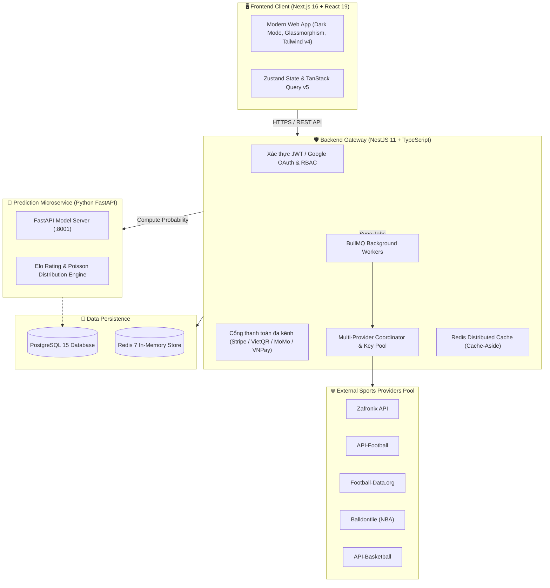

# ⚽🏀 iKnowBall — Next-Gen AI Sports Analytics & Quantitative Prediction Platform

  
  
  
  
  
  

---

## 📖 Giới Thiệu Tổng Quan

**iKnowBall** là nền tảng phân tích định lượng và mô hình hóa dữ liệu thể thao thế hệ mới, kết hợp sức mạnh của **Trí tuệ Nhân tạo (Machine Learning)**, **Thuật toán Hệ số Elo** và **Mô hình Phân phối Xác suất Poisson** nhằm cung cấp cho người hâm mộ và các nhà nghiên cứu dữ liệu cái nhìn trực quan, minh bạch và khoa học nhất về xác suất thống kê kết quả thi đấu.

Hệ thống hỗ trợ toàn diện cả **Bóng đá (Football)** hàng đầu thế giới (Ngoại hạng Anh, La Liga, Champions League, Serie A, Bundesliga, Ligue 1) và giải **Bóng rổ nhà nghề Mỹ (NBA)**, tích hợp radar phân tích độ lệch dữ liệu thị trường (Market Inefficiency & Odds Volatility Radar) cùng cổng thanh toán hội viên đa kênh.

---

## ✨ Điểm Nhấn & Tính Năng Vượt Trội

### 1. 🤖 Động Cơ Dự Đoán AI & Minh Bạch Thuật Toán (Explainable AI)
* **Xác suất phân phối đa chiều (Probability Engine)**: Tính toán phân phối xác suất Thắng - Hòa - Thua (1X2) dựa trên thuật toán học máy và dữ liệu lịch sử đối đầu chuyên sâu.
* **Mô hình Elo & Phong độ thích ứng**: Tự động cập nhật chỉ số sức mạnh Elo theo từng vòng đấu, tính toán trọng số sân nhà/sân khách, độ khốc liệt của từng giải đấu và phong độ 5 trận gần nhất.
* **Minh bạch dự đoán (XAI)**: Trực quan hóa mức độ đóng góp của từng biến số (Feature Importance), đánh giá độ tin cậy và kiểm chuẩn chất lượng mô hình định kỳ theo thước đo toán học chuẩn quốc tế (**Brier Score** & **Log Loss**).

### 2. ⚡ Radar Phân Tích Độ Lệch Xác Suất & Biến Động Thị Trường (Market Inefficiency Radar)
* **Chỉ số Kỳ vọng Toán học (+EV Index)**: Tự động so sánh xác suất từ mô hình toán học/AI với các chỉ số tham chiếu thị trường quốc tế để nhận diện các độ lệch phân phối thống kê có ý nghĩa.
* **Theo dõi Xu hướng Biến động (Odds Movement Feed)**: Giám sát sự biến thiên của các chỉ số dữ liệu theo thời gian thực (Realtime), tự động gắn cờ cảnh báo khi xuất hiện biên độ dao động thống kê đột biến.
* **Hệ thống Thông báo Telegram (Realtime Analytics Alerts)**: Gửi thông báo tức thời về các trận đấu có chỉ số thống kê nổi bật hoặc biến động dữ liệu đáng chú ý trực tiếp qua Telegram.

### 3. 🌐 Bộ Điều Phối Dữ Liệu Đa Nhà Cung Cấp (Multi-Provider Coordinator & Key Pool)
* **Tự động chuyển đổi dự phòng (Zero-Downtime Failover)**:
  * **Bóng đá**: Zafronix API $\rightarrow$ API-Football $\rightarrow$ Football-Data.org.
  * **Bóng rổ**: Balldontlie API $\rightarrow$ API-Basketball (API-Sports).
* **Quản lý danh sách Key thông minh (Key Pool Manager)**: Tự động xoay tua (Round-robin) và kích hoạt cơ chế chờ (cooldown) khi một key chạm ngưỡng Rate Limit (HTTP 429), đảm bảo quá trình đồng bộ dữ liệu không bao giờ bị gián đoạn.

### 4. 💳 Cổng Thanh Toán Đa Kênh & Quản Lý Hội Viên
* **Gói dịch vụ linh hoạt**:
  * 🆓 **Gói Free**: Tra cứu lịch thi đấu, kết quả, bảng xếp hạng và xác suất dự đoán cơ bản.
  * 🌟 **Gói Pro (149.000 đ/tháng)**: Mở khóa phân tích xác suất chuyên sâu, radar độ lệch thị trường (+EV Index), thống kê đối đầu (H2H) mở rộng.
  * 👑 **Gói VIP (1.490.000 đ/năm)**: Toàn quyền truy cập mọi trung tâm phân tích nâng cao, nhận cảnh báo dữ liệu sớm qua Telegram, cấp quyền truy cập Developer API Key.
* **Đa dạng phương thức thanh toán**:
  * **Quốc tế**: Thanh toán thẻ toàn cầu qua **Stripe Checkout** an toàn chuẩn PCI-DSS.
  * **Nội địa Việt Nam**: Quét mã **VietQR** tự động (SeABank, Techcombank, VietinBank, MBBank) và các ví điện tử hàng đầu (**MoMo**, **VNPay**, **ZaloPay**).

### 5. 💬 Tương Tác Cộng Đồng & Dữ Liệu Trực Tiếp
* **Live Scoreboard**: Cập nhật diễn biến trận đấu, tỷ số trực tiếp và các mốc sự kiện quan trọng theo thời gian thực.
* **Không gian Thảo luận (Match Discussion Space)**: Nơi cộng đồng người hâm mộ thể thao trao đổi nhận định chuyên môn và phân tích chiến thuật trước và trong trận đấu.

---

## 🏛 Kiến Trúc Hệ Thống (System Architecture)

Dự án được xây dựng theo kiến trúc **Microservices phân tầng**, tối ưu cho hiệu năng cao, khả năng mở rộng (scalability) và độ tin cậy:

---

## 🛠️ Ngăn Xếp Công Nghệ (Tech Stack)

| Lớp (Layer) | Công nghệ chính | Vai trò kỹ thuật |
| :--- | :--- | :--- |
| **Giao diện (Frontend)** | `Next.js 16`, `React 19`, `Tailwind CSS v4`, `Lucide React`, `Recharts`, `Zustand` | Hiển thị giao diện Dashboard sắc nét, biểu đồ thống kê tương tác, trải nghiệm người dùng mượt mà |
| **Dịch vụ Backend** | `NestJS 11`, `TypeScript`, `Prisma ORM 7`, `BullMQ`, `Passport JWT & Google OAuth` | Điều hướng API, bảo mật phân quyền (RBAC), điều phối dữ liệu thể thao và tích hợp thanh toán |
| **Dịch vụ AI (Machine Learning)** | `Python 3.11`, `FastAPI`, `NumPy`, `Scikit-Learn`, `SciPy` | Mô hình phân tích thống kê xác suất, thuật toán tính điểm Elo và phân phối xác suất Poisson |
| **Cơ sở dữ liệu & Bộ nhớ đệm** | `PostgreSQL 15`, `Redis 7` | Lưu trữ dữ liệu quan hệ bền vững, bộ nhớ đệm phân tán với thời gian phản hồi dưới 5ms |
| **Dữ liệu Thể thao (Sports Pool)** | `Zafronix`, `API-Football`, `Football-Data.org`, `Balldontlie`, `API-Basketball` | Nguồn cấp dữ liệu lịch thi đấu, tỷ số, BXH và thông tin đội bóng đa môn |
| **Hạ tầng & Đóng gói** | `Docker`, `Docker Compose` | Đóng gói toàn bộ hệ thống sẵn sàng vận hành trên môi trường đám mây |

---

## 📱 Giao Diện Ứng Dụng (User Interfaces)

* **Trang chủ & Lịch thi đấu**: Theo dõi tổng quan tất cả các trận đấu bóng đá và bóng rổ trong ngày với các chỉ số tham chiếu trực quan.
* **Chi tiết Trận đấu & Phân tích AI**: Xem biểu đồ cán cân lực lượng, tỷ lệ xác suất thắng/hòa/thua, lịch sử đối đầu và phong độ gần đây.
* **Radar Phân Tích (Alerts Hub)**: Danh sách các trận đấu có chỉ số biến động thị trường lớn và độ lệch xác suất thống kê đáng chú ý (+EV).
* **Bảng Xếp Hạng & Thống Kê Giải Đấu**: Bảng xếp hạng chi tiết của 6 giải bóng đá lớn nhất Châu Âu và toàn bộ 30 đội bóng NBA.
* **Cổng Quản Trị Hệ Thống (Admin Portal)**: Quản lý người dùng, giao dịch nạp tiền, kích hoạt đồng bộ dữ liệu và giám sát hàng đợi hệ thống.

---

  <b>© 2026 iKnowBall Team. Nền tảng phân tích định lượng dữ liệu thể thao thông minh.</b>

