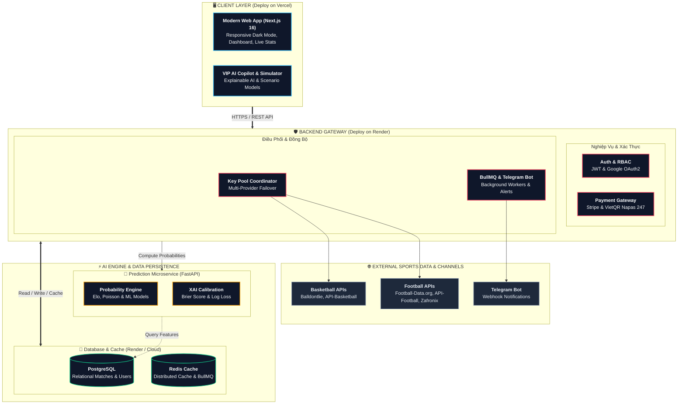

# ⚽🏀 iKnowBall — Nền Tảng Phân Tích Định Lượng & Dự Đoán Thể Thao AI Thế Hệ Mới

  
  
  
  
  
  

---

## 🌟 1. Giới Thiệu Tổng Quan Dự Án

**iKnowBall** là nền tảng phân tích thể thao định lượng (**Quantitative Sports Analytics**) và dự đoán kết quả thông minh được xây dựng nhằm mang đến cho người hâm mộ, chuyên gia phân tích và nhà đầu tư thể thao cái nhìn khoa học, minh bạch và chính xác nhất về mọi trận đấu.

Khác với các trang tin tức hay nhận định cảm tính thông thường, **iKnowBall** hoạt động với triết lý:
> *"Cảm xúc là của người hâm mộ, con số là của chúng tôi."*

Hệ thống kết hợp sức mạnh của các mô hình toán học thống kê chuẩn xác (**Hệ số sức mạnh Elo thích ứng**, **Phân phối Poisson hai biến**), thuật toán **Học máy (Machine Learning)** cùng công nghệ **Explainable AI (XAI)** để bóc tách từng yếu tố ảnh hưởng đến cục diện trận đấu: phong độ, chênh lệch thực lực, lợi thế sân bãi, lịch sử đối đầu (H2H) và dữ liệu thị trường theo thời gian thực.

---

## 🎯 2. Phạm Vi Dữ Liệu & Hạn Chế Của Hệ Thống (Scope & Limitations)

> [!IMPORTANT]
> Để đảm bảo độ chuẩn xác cao nhất của mô hình xác suất toán học và độ tin cậy của chỉ số Elo, **iKnowBall tập trung chuyên sâu vào các giải đấu thể thao đỉnh cao thế giới**, không dàn trải vào các giải đấu chất lượng thấp.

### 🏆 Các giải đấu chính thức được hỗ trợ:
* ⚽ **Bóng đá đỉnh cao (Top 6 giải đấu hàng đầu Châu Âu)**:
  * 🏴󠁧󠁢󠁥󠁮󠁧󠁿 **Premier League** (Ngoại hạng Anh)
  * 🇪🇸 **La Liga** (Vô địch quốc gia Tây Ban Nha)
  * 🇮🇹 **Serie A** (Vô địch quốc gia Ý)
  * 🇩🇪 **Bundesliga** (Vô địch quốc gia Đức)
  * 🇫🇷 **Ligue 1** (Vô địch quốc gia Pháp)
  * 🇪🇺 **UEFA Champions League** (Cúp C1 Châu Âu)
* 🏀 **Bóng rổ nhà nghề Mỹ (NBA)**: Toàn bộ 30 câu lạc bộ miền Đông và miền Tây.

### ⚠️ Hạn chế & Cơ chế hiển thị dữ liệu cần lưu ý:
1. **Không thu thập giải hạng dưới & giải cỏ**: Hệ thống **không** lấy dữ liệu các giải hạng 2, hạng 3, cúp quốc nội quy mô nhỏ, giải giao hữu hoặc bóng đá phong trào.
2. **Khoảng trống lịch thi đấu giữa tuần**: Các giải vô địch quốc gia hàng đầu châu Âu chủ yếu thi đấu tập trung vào **cuối tuần (Thứ 7 & Chủ Nhật)** hoặc giữa tuần khi có lịch Cúp C1. Vào các ngày đầu tuần hoặc ngày không có lịch thi đấu của 6 giải lớn này, danh sách trận đấu hôm nay sẽ không có trận mới.
3. **Cơ chế Fallback thông minh (Hiển thị dữ liệu mẫu/lịch sử)**: Khi một ngày cụ thể không có trận đấu diễn ra, giao diện trang chủ sẽ tự động hiển thị các trận cầu tâm điểm gần nhất có trong cơ sở dữ liệu để đảm bảo trải nghiệm trực quan, giúp người dùng luôn có thể thử nghiệm đầy đủ các công cụ phân tích AI, Simulator và Copilot.

---

## ✨ 3. Tính Năng Nổi Bật Của iKnowBall

### 🤖 Động Cơ Phân Tích Xác Suất AI & Minh Bạch Thuật Toán (Explainable AI)
* **Probability Engine Đa Chiều**: Tính toán phân phối xác suất Thắng – Hòa – Thua (1X2), ma trận xác suất tỷ số chính xác và tổng số bàn thắng kỳ vọng (xG / Total Points).
* **Mô Hình Elo & Phong Độ Thích Ứng**: Cập nhật chỉ số sức mạnh Elo liên tục sau mỗi vòng đấu, tính toán trọng số sân nhà/sân khách, độ khó của lịch thi đấu (SoS - Strength of Schedule).
* **Kiểm Chuẩn Mô Hình Thực Nghiệm**: Trực quan hóa chuẩn xác các chỉ số sai số chuẩn quốc tế như **Brier Score** và **Log Loss** qua từng mùa giải.

### ⚡ Trợ Lý VIP AI Copilot & Trình Mô Phỏng Kịch Bản Trận Đấu (Simulator)
* **Interactive AI Copilot**: Trợ lý trò chuyện thông minh hỗ trợ giải đáp chi tiết về tương quan lực lượng, chiến thuật và kịch bản bất ngờ của từng cặp đấu.
* **Match Outcome Simulator**: Công cụ tương tác trực quan cho phép người dùng tự điều chỉnh các biến số (tỷ lệ kiểm soát bóng, thẻ phạt, chấn thương cầu thủ chủ chốt) để theo dõi xác suất biến đổi theo thời gian thực.
* **Value Bet (+EV) Scanner**: Thuật toán tự động phát hiện cơ hội chênh lệch giá trị toán học dương so với tỷ lệ tham chiếu quốc tế.

### 📊 Radar Biến Động Thị Trường & Cảnh Báo Telegram (Market Radar)
* **Theo dõi biến động Odds thời gian thực**: Giám sát biên độ dao động chỉ số dữ liệu, cảnh báo khi có dòng tiền hoặc thông tin đột biến trước giờ bóng lăn.
* **Telegram Analytics Alert Bot**: Tự động gửi cảnh báo tức thì về kênh Telegram cho người dùng VIP khi xuất hiện trận đấu có chỉ số kỳ vọng (+EV) cao.

### 🔄 Bộ Điều Phối Dữ Liệu Đa Nhà Cung Cấp (Multi-Provider Resilient Sync)
* **Zero-Downtime Failover**: Tự động chuyển đổi mượt mà giữa nhiều nhà cung cấp dữ liệu thể thao quốc tế (**Football-Data.org**, **API-Football**, **Zafronix**, **Balldontlie**, **API-Basketball**).
* **Key Pool Manager**: Tự động xoay tua API Key và phân phối tải thông minh, loại bỏ hoàn toàn nguy cơ gián đoạn do chạm giới hạn băng thông (Rate Limit).

### 💳 Cổng Thanh Toán Đa Kênh & Quản Lý Hội Viên
* **Thanh toán quốc tế**: Tích hợp cổng thẻ tín dụng/ghi nợ an toàn toàn cầu qua **Stripe Checkout** (chuẩn PCI-DSS).
* **Thanh toán nội địa Việt Nam**: Quét mã **VietQR** tự động (Napas 247) liên kết các ngân hàng lớn và ví điện tử phổ biến.
* **Phân quyền gói linh hoạt**: Quản lý 3 hạng thành viên (**Free**, **Pro**, **VIP**) với các quyền hạn tính năng phân tầng rõ rệt.

---

## 🏛 4. Kiến Trúc Hệ Thống (System Architecture)

Dự án được xây dựng theo mô hình **Microservices phân tầng**, phân tách độc lập giữa giao diện người dùng, cổng xử lý nghiệp vụ, dịch vụ tính toán AI và tầng lưu trữ phân tán:

---

## 🛠️ 5. Ngăn Xếp Công Nghệ (Technology Stack)

| Phân hệ | Công nghệ sử dụng | Điểm nổi bật & Vai trò kỹ thuật |
| :--- | :--- | :--- |
| **Frontend Web** | `Next.js 16`, `React 19`, `Tailwind CSS v4`, `Lucide React`, `Recharts`, `TanStack Query` | Giao diện hiện đại, tối ưu SEO, Dark Mode sang trọng, biểu đồ tương tác mượt mà. Triển khai tự động trên **Vercel**. |
| **Backend Gateway** | `NestJS 11`, `TypeScript`, `Prisma ORM 7`, `BullMQ`, `Passport JWT & Google OAuth` | Hệ thống REST API chuẩn hóa, kiến trúc module rõ ràng, bảo mật đa tầng, quản lý hàng đợi nền. Triển khai trên **Render**. |
| **Prediction AI** | `Python 3.11`, `FastAPI`, `NumPy`, `Scikit-Learn`, `SciPy` | Thuật toán tính ma trận Poisson, cập nhật hệ số Elo và đánh giá sai số mô hình. |
| **Cơ sở dữ liệu & Cache** | `PostgreSQL 15+`, `Redis 7 (Upstash / Cloud)` | Lưu trữ dữ liệu quan hệ bền vững, bộ nhớ đệm phân tán với thời gian phản hồi cực nhanh (< 5ms). |
| **Nhà cung cấp thể thao** | `Football-Data.org`, `API-Football`, `Zafronix`, `Balldontlie` | Cung cấp dữ liệu thời gian thực các giải đấu hàng đầu thế giới. |

---

## 💎 6. Các Gói Dịch Vụ & Quyền Lợi Thành Viên

| Tính Năng / Quyền Lợi | 🆓 Gói Free | 🌟 Gói Pro | 👑 Gói VIP |
| :--- | :---: | :---: | :---: |
| **Tra cứu lịch thi đấu & BXH** | ✅ Có | ✅ Có | ✅ Có |
| **Dự đoán xác suất cơ bản (1X2)** | ✅ Có | ✅ Có | ✅ Có |
| **Ma trận tỷ số & Phân tích chuyên sâu** | ❌ Không | ✅ Có | ✅ Có |
| **Radar Kèo Giá Trị (+EV Scanner)** | ❌ Không | ✅ Có | ✅ Có |
| **Trợ lý tương tác VIP AI Copilot** | ❌ Không | ❌ Không | ✅ Có |
| **Trình mô phỏng kịch bản (Simulator)** | ❌ Không | ❌ Không | ✅ Có |
| **Nhận cảnh báo Telegram Realtime** | ❌ Không | ❌ Không | ✅ Có |
| **Cấp quyền Developer API Key** | ❌ Không | ❌ Không | ✅ Có |

---

## 🔒 7. Bản Quyền & Tuyên Bố Miễn Trừ Trách Nhiệm (Disclaimer)

* **Tuyên bố trách nhiệm**: **iKnowBall** là nền tảng nghiên cứu và phân tích dữ liệu thể thao định lượng thuần túy phục vụ mục đích thông tin, thống kê học thuật và giải trí. Nền tảng **không** cung cấp bất kỳ dịch vụ đặt cược hay cờ bạc trực tiếp nào.
* **Bản quyền**: © 2026 **iKnowBall Team**. Toàn bộ mã nguồn, thiết kế giao diện và giải pháp thuật toán được phát triển và sở hữu bởi iKnowBall.
